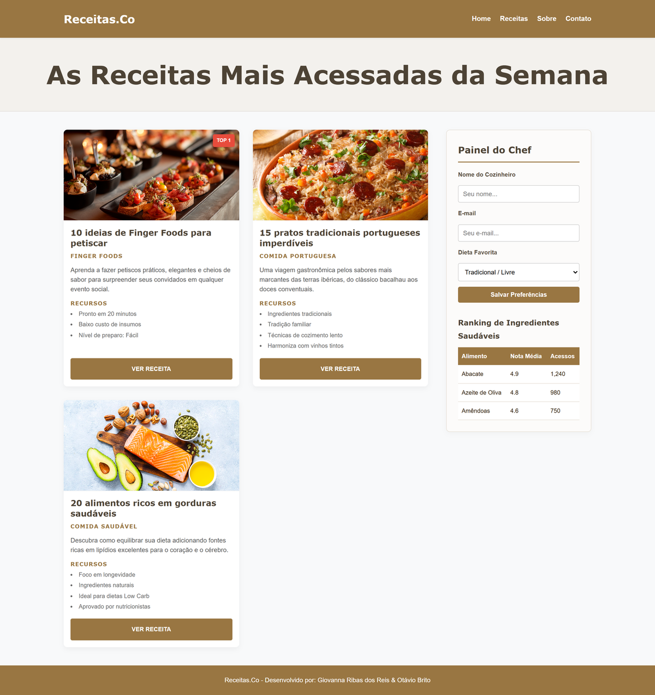

# Receitas.Co

A multi-page static website for a recipe site, built with HTML and CSS. Early
front-end academic project.

## Pages

- `index.html` - home, with the week's most-viewed recipes and a "Chef panel" form
- `receitas.html` - recipe listing
- `sobre.html` - about
- `contato.html` - contact form

## Tech

- HTML
- CSS

## Running

Open `index.html` in a browser. No build step or dependencies.

## Authorship

Team project by Giovanna Ribas dos Reis and Otávio Brito (per the site footer).
